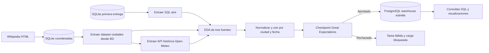
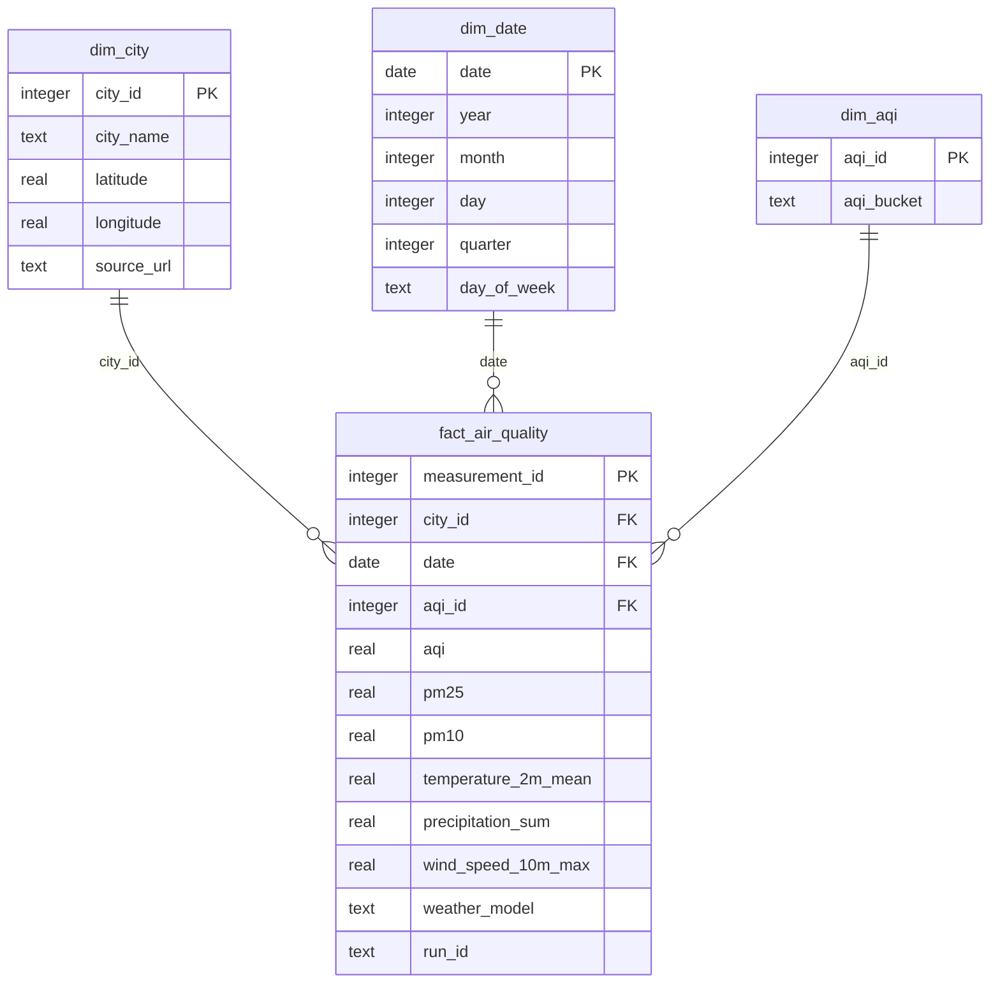

#diagramas de la segunda entrega

#arquitectura

```mermaid
flowchart LR
  S1[(SQLite primera entrega)] --> A[Extraer SQL aire]
  W[Wikipedia HTML] --> C[(SQLite coordenadas)]
  C --> B[Extraer dataset ciudades desde BD]
  B --> P[Extraer API histórica Open-Meteo]
  A --> E[EDA de tres fuentes]
  B --> E
  P --> E
  E --> T[Normalizar y unir por ciudad y fecha]
  T --> Q[Checkpoint Great Expectations]
  Q -->|Aprobado| D[(PostgreSQL warehouse estrella)]
  Q -->|Rechazado| F[Tarea fallida y carga bloqueada]
  D --> V[Consultas SQL y visualizaciones]
```

#modelo estrella

grano: una medicion por ciudad y dia. el ddl completo esta en `sql/warehouse.sql`; el diagrama destaca las medidas principales.

```mermaid
erDiagram
  dim_city ||--o{ fact_air_quality : city_id
  dim_date ||--o{ fact_air_quality : date
  dim_aqi ||--o{ fact_air_quality : aqi_id
  dim_city {
    integer city_id PK
    text city_name
    real latitude
    real longitude
    text source_url
  }
  dim_date {
    date date PK
    integer year
    integer month
    integer day
    integer quarter
    text day_of_week
  }
  dim_aqi {
    integer aqi_id PK
    text aqi_bucket
  }
  fact_air_quality {
    integer measurement_id PK
    integer city_id FK
    date date FK
    integer aqi_id FK
    real aqi
    real pm25
    real pm10
    real temperature_2m_mean
    real precipitation_sum
    real wind_speed_10m_max
    text weather_model
    text run_id
  }
```
